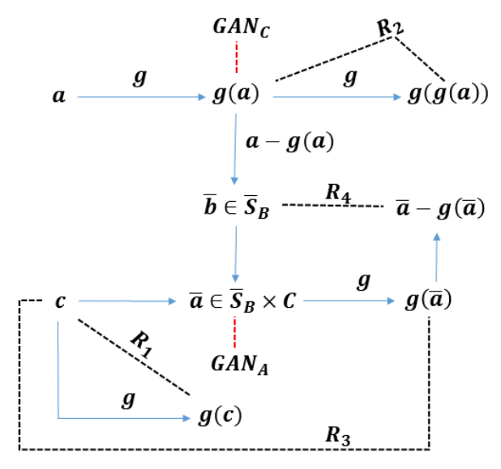

# Singing

This repository provides a PyTorch implementation of "Semi-supervised Monaural Singing Voice Separation with a Masking Network Trained on Synthetic Mixtures" [(paper)](https://arxiv.org/abs/1812.06087).

The network learns to seperate vocals from music, by training on a set of samples of mixed music (singing and instrumental) and an unmatched set of instrumental music. **Comparison with a fully supervised method can be found [here](https://sagiebenaim.github.io/Singing/)**

The algorithm is based on two main ideas: 
1. Utilizing GAN losses for alinging the distribution of masked samples with instrumental music and the distribution of synthetic samples with real mixture samples.
2. Reconstruction losses based on the architecture and the superposition property of audio channels, creating more stable constrain than the GAN loss.



## Dependencies
A conda environment file is available in the repository.
* Python 3.6 +
* Pytorch 0.4.0
* Torchvision
* Tensorboardx
* librosa
* tqdm
* imageio
* opencv
* musdb
* dsd100

## Usage

### 1. Cloning the repository & setting up conda environment
```
$ git clone https://github.com/sagiebenaim/Singing.git
$ cd Singing/
```
For creating and activating the conda environment:
```
$ conda env create -f environment.yml
$ source activate singing
```

### 2. Downloading the dataset & Preprocessing

To download the DSD100 dataset:
```
$ bash download.sh DSD100
```
To download the MUSDB18 dataset, you must request access to the dataset from this [website](https://zenodo.org/record/1117372/accessrequest). Then, you need unzip the file to `./dataset/` folder
 
For creating the spectrograms for training, run the following command
```
$ python dataset.py --dataset DSD100 
```
The default spectrograms are for vocals and accompaniment seperation. for drums/bass, use the `--target drums`/`--target bass` option 
 
### 3. Training
Run the training script below.

```bash
$ python train.py --config configs/vocals_new.yaml
```
 
### 4. Testing

To test on the DSD100 dataset:

```bash
$ python test.py
```

### 5. Pretrained model & evaluation

To separate music channels (default:vocals and accompaniment) for DSD100, using the pretrained model, run the script below. The audio files will be saved into `./outputs` directory.

```bash
$ python create_songs.py
```

The script contains the function `create_songs` for creating vocals and accompaniment for any given song directory, for file format supported by [soundfile](https://pysoundfile.readthedocs.io/en/0.9.0/).
for doing so, create a folder named `./input`, move there the files and run the script:
```bash
$ python create_songs.py --input custom
```
## Reference
If you found this code useful, please cite the following paper:
```
  @inproceedings{michelashvili2018singing,
  title={Semi-Supervised Monaural Singing Voice Separation With a Masking Network Trained on Synthetic Mixtures},
  author={Michael Michelashvili and Sagie Benaim and Lior Wolf},
  booktitle={ICASSP},
  year={2019},
}
```

## Acknowledgement
This repository is based on the code from [MUNIT](https://github.com/NVlabs/MUNIT)
